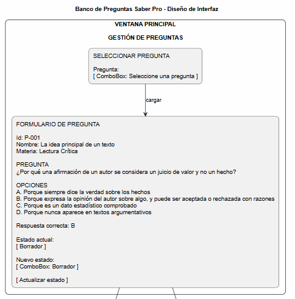
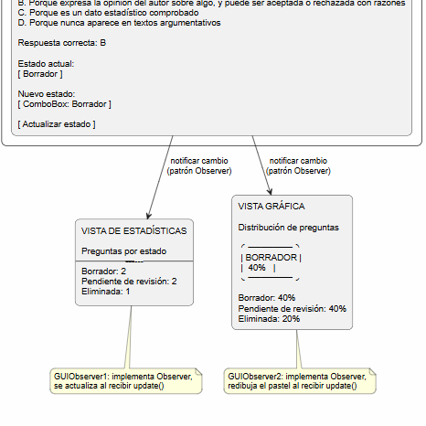

# Banco de Preguntas Saber Pro

Taller del curso **Ingeniería de Software II** (Universidad del Cauca) —
aplicación de escritorio en Java Swing para gestionar un banco de preguntas
de preparación para las pruebas Saber Pro.

Aplica **arquitectura en capas**, el **micro patrón MVC** y el **patrón
Observer**.

## Funcionalidad

- Selecciona una pregunta desde un ComboBox y visualiza su información:
  Id, Nombre, Materia, Pregunta, Opciones, Respuesta correcta y Estado.
- Cambia el estado de una pregunta entre `Borrador`, `Pendiente de revisión`
  y `Eliminada`.
- Al cambiar el estado, dos vistas se actualizan automáticamente sin que la
  ventana principal las conozca:
  - **Vista de estadísticas**: cuántas preguntas hay por cada estado.
  - **Vista gráfica**: gráfica de pastel con el porcentaje por estado.

Las preguntas de ejemplo corresponden a los módulos genéricos reales del
Saber Pro: Lectura Crítica, Razonamiento Cuantitativo, Competencias
Ciudadanas, Comunicación Escrita e Inglés.

## Arquitectura

```
src/
├── presentation/   Interfaces gráficas (Swing) y punto de entrada (Main)
├── domain/         Entidades, reglas de negocio y servicios
├── access/         Persistencia (repositorio en memoria)
└── infra/          Contratos transversales del patrón Observer
```

- **presentation** solo habla con **domain**, nunca con **access** directamente.
- **domain** define `QuestionRepository` (interfaz); **access** la implementa.
  Esto permite cambiar la persistencia sin tocar el resto del sistema.
- **infra** aporta `Observer` y `Subject`, usados por `QuestionService`
  (Subject) y por `GUIObserver1` / `GUIObserver2` (Observers).

### Patrón Observer en acción

```
GUIQuestions --> QuestionService.cambiarEstado()
                        │
                        ├─> QuestionRepository.actualizarEstado()
                        └─> notifyObservers()
                                 ├─> GUIObserver1.update()  (estadísticas)
                                 └─> GUIObserver2.update()  (gráfica)
```

## Diseño de interfaz

El mockup de la interfaz (código fuente en `diseno-interfaz.puml`) se
encuentra en la raíz del repositorio.




## Cómo compilar y ejecutar

Requiere JDK 8 o superior.

```bash
# compilar
mkdir bin
javac -d bin $(find src -name "*.java")

# ejecutar
java -cp bin presentation.Main
```

## Tecnologías

- Java SE (Swing) — sin librerías externas.
- Persistencia en memoria (`Map`), fácilmente reemplazable por una base
  de datos real gracias a la interfaz `QuestionRepository`.

## Autor

Yuu — Ingeniería de Sistemas, Universidad del Cauca
